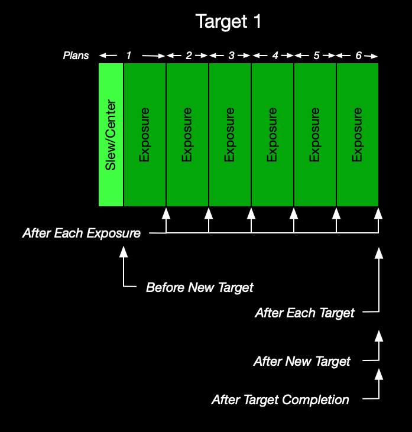

# Planning Engine

The following sections describe the scheduling/planning approach used by the plugin.

## Dispatch Scheduling

Target Scheduler is a _dispatch scheduler_ [^1], meaning it generates a plan on demand covering the 'next' step only.  This is in contrast to a _static_ or _global_ scheduler that would generate a plan for the entire night.  Although it might seem like a static plan is a better approach, dispatch scheduling has several advantages in the context of automated imaging:
* If you generate a plan for the whole night, it's almost immediately out of sync with reality due to other operations that may take place: slew/center, autofocus, meridian flip, center after drift, dither settle, etc.  Some of these can be predicted and estimated - but not all and not consistently.
* A dispatch scheduler can take new information into account.  For example, images may or may not be deemed acceptable by the [image grader](../post-acquisition/image-grader.html), which changes the number of images remaining for a target, which impacts the next plan.
* You can make changes to the project/target database that will be used during the very next planning cycle.
* Dispatch scheduling is a better match for the NINA Advanced Sequencer and its approach to automation and triggers/interrupts.
* In the future, the plugin may support constraints based on weather metrics such as sky quality which can obviously change over the course of a night.

## Plan Types and Timelines

The Planning Engine executes a series of steps to pick the best target to image at the moment and then schedule the applicable exposures for that target.  It operates in phases and in the end, produces a _Scheduler Plan_.

A Scheduler Plan is either:
* **Target Plan**: the selected target and exposure, instructions to run, the start and estimated stop times, and a hard stop time.
* **Wait Plan**: a plan to tell the Target Scheduler instruction it needs to simply wait for target availability.  At the end of the delay, it will call the planner again.

The hard stop time is the end of visibility for the target and an interrupt will be triggered if this time is exceeded.

{: .note }
Prior to version 5, Target Scheduler produced target plans built to take multiple exposures - enough to fill the project's minimum time.  This had several undesirable side effects so the planner was rewritten to produce single-exposure plans.

### Target Plans

The below timeline shows a sequence of six target plans generated by the planner, all consecutive exposures for the same target.  The timing of the [custom event containers](../sequencer/container.html#custom-event-instructions) is also shown.

Sequence of events:

#### Plan 1
The planner is called and Target 1 is returned.  This target is 'new', meaning the first target of the night, the target selected immediately after a Wait period, or simply different from the previous target.  We also assume that these six plans will be following by a different target, a Wait period, or the end of the night.  Execute:
* Slew, center, and optional rotate to Target 1
* Optional instructions for 'Before New Target' (executed immediately after the slew/center)
* Change filter (if needed) and set camera readout mode
* Take exposure
* Optional instructions for 'After Each Exposure'

#### Plans 2-5
* Change filter (if needed) and set camera readout mode
* Take exposure
* Optional instructions for 'After Each Exposure'

#### Plan 6
* Change filter (if needed) and set camera readout mode
* Take exposure
* Optional instructions for 'After Each Exposure'
* Optional instructions for 'After Each Target'
* Optional instructions for 'After New Target'
* If this exposure caused the target to reach 100% completion on all exposure plans, then the optional instructions for 'After Target Completion' will be run

### Wait Plan

If there are no targets that can be imaged at the present time, Target Scheduler will determine when the first potential target will be available and return a plan to simply delay further execution until that time.

The Before Wait and After Wait custom event containers are run before/after the wait.

Determining when the next potential target will be ready is non-trivial.  In addition to checking future visibility, we also have to account for moon avoidance at that time - which could be substantially different if advanced avoidance is used.  Since this is an expensive activity, the approach uses time sampling with an interval of 1 minute.

## Planner Operation
The following sections detail the different phases of planner operation.  At a high level, the Target Scheduler Container instruction runs a loop to call the planner to get the next plan and then executes the plan instructions.  The planner itself performs the following tasks each time it is called.

### Previous Target Stickiness
In order to implement the Project Minimum Time setting, we need to determine if we have a previous target and if it is still acceptable.  Continue with the previous target if:
* The target hasn't reached 100% complete on all exposure plans
* We can select an incomplete exposure plan not rejected by moon avoidance
* There is enough time remaining in the target's initial minimum time span to take the next exposure

If we can continue with this target, then an exposure is selected (see below), the instructions are generated, and the plan is returned.  Otherwise, the planner continues.

## Select Candidate Projects/Targets
* Retrieve the list of active projects for the current NINA profile from the database
* Reject those that can never rise at this latitude
* Reject those that are already complete

All remaining targets are the placed into the _candidate target list_.

## Determine Target Visibility

To determine target visibility throughout a night, the planner determines each target's altitude and azimuth from sunset to sunrise.  The values are calculated at discrete intervals (every 10 seconds by default).  This data is cached for performance.

The planner needs to determine if the target is above the _horizon_ for (at least) an interval starting now and continuing for the target's minimum time.  In this case, the _horizon_ altitude at any azimuth is the higher of:
* The NINA profile custom horizon (if defined and enabled) plus any optional horizon offset
* Or the project's minimum altitude

Basic visibility is then a simple matter of checking for target altitude > horizon at each azimuth over the sampled time span.  However, we also need to determine if:
* The target is currently inside it's optional meridian window and the window lasts long enough to image for the minimum time
* The target interval might be interrupted by a meridian flip and your profile uses a pause before meridian (see [below](#meridian-flip-safety) for details).
* The target is below the maximum altitude for the entire minimum time span

Any target that does not meet the visibility criteria is removed from the candidate target list.

## Moon Avoidance

For each target remaining in the candidate list:
1. For each exposure plan/template that enables moon avoidance, calculate the avoidance properties and reject those plans that violate the criteria.
2. If all exposure plans for a target were rejected, then remove the target from the candidate list.

Note that we also calculate a moon avoidance score (see [below](#smart-exposure-selector)) for each exposure plan at this point which may be used later to select an exposure.

## Filter for Twilight

For each target remaining in the candidate list:
1. For each exposure plan, reject those that can't be imaged now due to the exposure template settings and the current level of darkness.
2. If all exposure plans for a target were rejected, then remove the target from the candidate list.

## Filter for Available Now
Determine which of the remaining candidate targets can be imaged at the current time (as opposed to those that will become imagable later in the night).  These are the _ready targets_.

At this point, there are four possibilities based on the ready targets list:
* If no targets remain in the ready or candidate lists, then we are done for the night and an empty plan is returned.
* If no targets can be imaged now but at least one could be imaged later, then a Wait plan is returned with the wait period set to end when the first target becomes available.
* If only a single target is available now, then that becomes the selected target.
* Otherwise, we run the [_Scoring Engine_](#scoring-engine) (see below) on all ready targets to determine the selected target.

## Exposure Selection and Dithering
If we have a selected target, we need to determine the next exposure for this target.  The selected exposure depends on the exposure selection method that applies, which is based on the target's project settings and other state information.

### Filter Cadence
For the Basic and Override Order selectors, a predetermined _filter cadence_ (ordering) is generated.  Either we know the filter (exposure plan) order based on project Filter Switch Frequency or because it was manually set via Override Order.  The filter cadence manages the next filter that should be picked and is persisted so that the selector can restore the state when the selector runs again - even across NINA sessions.

### Basic Exposure Selector
If the project doesn't enable Smart Exposure selection, the target doesn't override the exposure order, and the project Filter Switch Frequency is greater than zero, then the Basic Exposure Selector is used.  This selector will use the applicable Filter Cadence to determine the next exposure.  If this exposure plan was rejected (e.g. due to completeness, twilight, or moon avoidance), then try the next, cycling back to the start as needed.  We are guaranteed that at least one is acceptable - otherwise the target would have been rejected earlier.

### Repeat Until Done Exposure Selector
If the project doesn't enable Smart Exposure selection, the target doesn't override the exposure order, and the project Filter Switch Frequency is zero, then the Repeat Until Done Exposure Selector is used.  This selector simply picks the first exposure plan in the list that isn't rejected.

### Override Order Exposure Selector
If the target defines an override exposure order, then the Override Order Exposure Selector is used.  This selector uses the predefined Filter Cadence generated from that ordering and then operates like the Basic selector.

### Smart Exposure Selector
If the project has enabled Smart Exposure selection, then the Smart Exposure Selector is used.  This selector will use the moon avoidance scores (calculated earlier) to select an exposure:
* The exposure plan with the highest avoidance score is determined.
* If there are other exposure plans with a score within some small tolerance of the highest score they are also considered.  If Filter Switch Frequency is greater than zero, then the selector will repeat filters from that set before switching to the next.

The moon avoidance score for an exposure plan is calculated as follows.  The properties are defined on the exposure template used by the exposure plan.
* If moon avoidance is off, the score is 0.
* If avoidance is enabled and Moon Must be Down is true, the score is 1.
* Otherwise, the score is classic separation * width, normalized to 0-1.

Note that the score is completely independent of the actual target-moon separation.  Nevertheless, it serves as an indicator of how constraining the avoidance properties are.

The goal is to apply strict adherence to moon avoidance so that only broadband or other moon-sensitive filters are selected during the short time around new moon.  If only narrowband exposure plans remain, they can be selected.

### Dithering
In all cases, a dither instruction may be added before the selected exposure if appropriate.  We maintain the state of dithering for a target and only add a dither if the selected exposure plan is the _N+1th_ occurrence of a filter since the last dither, where _N_ is the project's Dither Every setting.

In the case of targets overriding the exposure order, the dithers defined in that manual ordering are used.

## Generate Sequence Instructions

The final step of a Target plan is generating the actual instructions that will be executed.  This is typically:
* A slew to the target coordinates and a center (plate solve) with optional rotate (only added if the target is new or different from the previous)
* Change filter and set camera readout mode (if needed)
* Perform a dither (if needed)
* Take the selected exposure

# Meridian Flip Safety

If a profile specifies a non-zero Pause before meridian value (Options > Imaging > Meridian flip settings), you are asserting that the mount/OTA cannot track past the meridian safely.  In this case, we want to clip a target's visibility such that the time interval from the pause (target transit - pause minutes), past the meridian, to the time at which it would be safe to flip (target transit + minutes after) is disallowed: the _no-flip_ or _unsafe_ zone.  

NINA would stop tracking anyway at the pause time so even without this extra clipping, your equipment should be safe.  However, by preemptively clipping out this interval, we let the planner take advantage of this extra implicit visibility information.

Note that this feature is independent of the Meridian Flip Penalty scoring rule discussed below.  Handling a pause before meridian is a safety concern.  The scoring rule is an optimization concern.

The no-flip zone is the time interval between:
* target transit - (Pause before meridian + 30s)
* target transit + (Minutes after meridian + 30s)

Note that the interval is expanded by 30s on either side for an extra margin of safety.

The planned visibility interval could be clipped:
* At the end, if the start time is before and the end time occurs in or after the no-flip interval
* At the start, if the start time occurs in the no-flip interval and the end occurs after
* Or rejected altogether if both start and end are in the no-flip zone

In general, you should not attempt to use a project Meridian Window if you have flip safety concerns.  See the notes on [meridian window interactions and conflicts](../target-management/projects.html#meridian-window-interactionsconflicts).

{: .warning }
Please heed the warning in the NINA documentation and only use Pause before meridian if your equipment cannot safely track past the meridian.

# Scoring Engine

The Planner uses a Scoring Engine to select a target when multiple candidates are under consideration.  The engine executes a set of rules on each target to produce a score, with the highest score winning.  The applicable Project has a set of configurable weights that are used to modulate the application of each rule.

### Scoring Rules

The following rules are currently implemented:

|Rule Name|Default Weight|Description|
|:--|:--|:--|:--|
|Meridian Flip Penalty|0%|A target scores higher if it does not need a meridian flip during the current minimum time imaging span.  The rationale is to avoid the time required for a flip: wait for flip, flip, center, etc.|
|Meridian Window Priority|75%|A target scores higher if the project it is associated with is using a Meridian Window to limit imaging time.  The rationale is to prefer targets using meridian windows since those windows are limited over the course of any imaging session.|
|Mosaic Completion|0%|If the project for the target is marked as a Mosaic project, then the target will score higher the lower its completion rate is to the average completion rate of the other targets in that project.  See [Exposure Plans](../target-management/exposure-plans.html#number-of-images--percent-complete) for details on how percent complete is determined.  The rationale is to balance exposures across the panels.|
|Percent Complete|50%|A target scores higher based on its [completion percentage](../target-management/exposure-plans.html#number-of-images--percent-complete).  The rationale is to prefer completion of a project over starting acquisition of something new.|
|Project Priority|50%|A project can set priority to High, Normal, or Low.  Targets for that project will score higher or lower depending on the setting.|
|Setting Soonest|50%|A target scores higher based on how close it is to setting below either the minimum altitude or (if enabled) the custom horizon.  The rationale is to prefer targets that will set before others, implying less time remaining in the target's imaging season.|
|Smart Exposure Order|0%|A target scores higher if it is using Smart Exposure ordering and the selected exposure has a high moon avoidance score.  The rationale is to prefer targets that are taking advantage of times with minimal moon impact to perform broadband imaging.|
|Target Switch Penalty|67%|A target scores higher if it is the same target as the one immediately preceding this run.  The rationale is that switching targets is expensive given the required slew/center time.|

A user can select different weights for each rule to achieve different goals.  Setting a weight to zero disables that rule entirely.

Note that the default weights for Meridian Window Priority and Target Switch Penalty are set higher than the others.  Missing a meridian window is a high opportunity cost since those windows are relatively 'scarce' during any session.  Switching targets is expensive given the slew/center time.

If you use Scheduler Preview, you can click the [View Details](../scheduler-preview.html#view-details) button to see a log of the planning details which includes the calculations for each scoring rule for each target.  The same information will be written to the [Target Scheduler log](../technical-details.html#logging) for actual planning runs from sequence execution.

### Rule Interactions and Conflicts

The scoring engine is designed to be easily extended by adding additional rules.  However, there is a limit with approaches like this.  As the number of rules increases, the predictability of engine outcomes goes down - and predictability can be desirable.  As the number grows it might be appropriate for users to select a subset that work well and disable the others.  Additional rules are under consideration - see the [roadmap](../roadmap.html#scoring-engine-rules).

In particular, the Percent Complete and Mosaic Completion rules may not interact well.  If your goal is to use Mosaic Completion to balance exposures across mosaic panels, then you probably want to set the weight for Mosaic Completion high and the Percent Complete and Target Switch Penalty weights to zero.

Also, unless you artificially set the rule weights to maximize the impact of the Meridian Flip Penalty rule, you're not likely to completely avoid the need for flips.  With typical settings for example, the Target Switch Penalty may cancel it out and plan for imaging through a flip.

[^1]: "Dispatch" is a general term in scheduling contexts but was also originally used by Bob Denny for the [ACP Observatory Control Program](https://acpx.dc3.com/) (which is also a dispatch scheduler).
