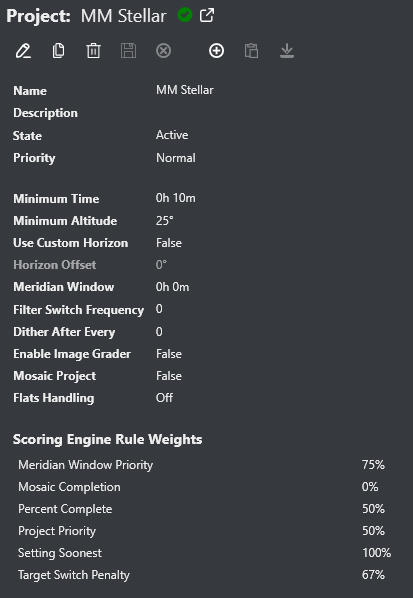
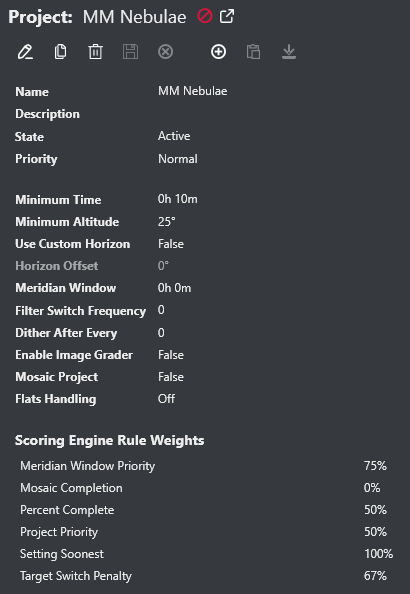
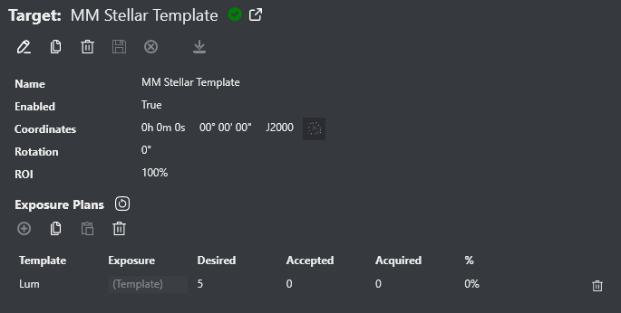
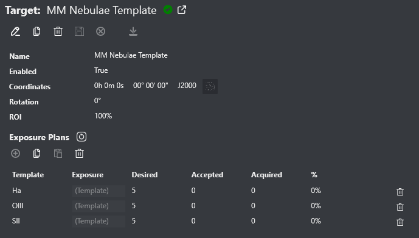
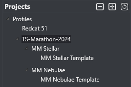

# Messier Marathon 2024

A [Messier Marathon](https://en.wikipedia.org/wiki/Messier_marathon) is typically an event for visual observers over the course of one night - an attempt to view all 110 Messier objects from dusk to dawn.

Given the distribution of the objects, the event is usually held in March/April when it's possible to view them all from northern latitudes (around 25° N is supposedly optimal) over a single night.  Southern hemisphere viewers certainly aren't excluded but there will be targets not available depending on your latitude.

Of course the best nights are centered around new moons during this time span.  In 2024, new moons are March 10 and April 8.  The latter is the total solar eclipse across much of North America and many of us will be pre-occupied with that.

Since Target Scheduler is pretty good at automating acquisition, it can be used to emulate a marathon and instead image the targets:
* The [bulk target loading](../target-management/targets.html#bulk-target-import) capability makes it easy to load the targets and assign appropriate exposure plans to the target types (e.g. galaxy/cluster or nebula).
* The Setting Soonest scoring rule will naturally prioritize targets farther in the west and setting earlier than others.  This emulates the visual observers who start in the West at dusk and work their way East, ending with the last targets visible at dawn.

If you landed on this page and don't know much about Target Scheduler, you should start with the [basics](../index.html).

## Rules of the Marathon

* No rules. The goal is simply to have fun and see what you can get.
* You're free to try it whenever you like, but the 2-3 nights around the new moon on March 10 would be good for folks who want to coordinate.  April 8 is also good for folks not heading to the eclipse.
* This is a pretty harsh test of TS so please report any problems you have.

## What Do I Do With the Images?

I've set up a private group on Discord to discuss this event, ask questions, upload images, etc.  Ping @tcpalmer in the #target-scheduler channel on the NINA project [Discord server](https://discord.com/invite/rWRbVbw) if you'd like to added.

Please upload your images to that group and include any pertinent details.  Depending on what we get, I may produce a combined mosaic of everything.

Bonus points for a timelapse video of your rig slewing all over the sky.

# Target Scheduler Configuration

The features of the bulk target loader make it pretty easy to get up and running.  The Messier objects [CSV file](TS-MM-2024.csv) segregates objects into just two types:
* Stellar - including galaxies and star clusters (99)
* Nebula - diffuse and planetary nebulae (11)

This breakdown is used so that we can apply appropriate exposure plans to each type.

You're free of course to load and configure these targets however you like.  The following description is just to get you started - but it does assume you're familiar with Target Scheduler.

## Create Projects

Begin by selecting the NINA profile you want to use.  It's best to take a good profile for the rig you want to use and copy it to something like 'MM 2024'.  That way, any other active projects/targets won't interfere with marathon imaging.

Create a new project named 'MM Stellar' under that profile.

Notes:
* Set state to Active.
* The minimum time should be short (like 10 minutes).
* Set the altitude and/or horizon settings appropriately.
* It's probably best to disable image grading.
* Set the Setting Soonest scoring rule weight to 100%.

Next, create another new project named 'MM Nebulae' under your profile.

Set it up similar to 'MM Stellar'.

## Target Templates

Target Templates are used during bulk import to assign exposure plans to imported targets.  Otherwise, you'd have to enter the same plans over and over on each target.  Be sure you have already created the [Exposure Templates](../target-management/exposure-templates.html) that you want to reference.

Create a new target under 'MM Stellar' named 'MM Stellar Template'

Notes:
* Be sure enabled is true.
* Add whatever exposure plans you'd like for all 'stellar' type objects.

Since the goal isn't fantastic SNR, you probably want to keep the number of exposures small.  Take as many as you like to support whatever post-processing you want to do - but it will cut into your time of course.

Next, create a new target under 'MM Nebula' named 'MM Nebula Template'

Set it up similar to 'MM Stellar Template' but add exposure plans suitable for nebulae.

At this point, you should have a project/target structure like:

## Load the Targets

Download the [CSV file](TS-MM-2024.csv).  Follow the instructions for [bulk loading](../target-management/targets.html#bulk-target-import) and do two separate loads.

### Stellar Objects

After selecting the CSV file,
* Set the Import Type Filter to 'Stellar'
* Set the Import Project to 'MM Stellar'
* Set the Target Template to 'MM Stellar Template'
* Click the import button, it should create 99 targets under the 'MM Stellar' project.

### Nebula Objects

After selecting the CSV file,
* Set the Import Type Filter to 'Nebula'
* Set the Import Project to 'MM Nebula'
* Set the Target Template to 'MM Nebula Template'
* Click the import button, it should create 11 targets under the 'MM Nebula' project.

At this point, you should have all 110 Messier targets loaded.  You can then run the Scheduler Preview to see what it would do.
