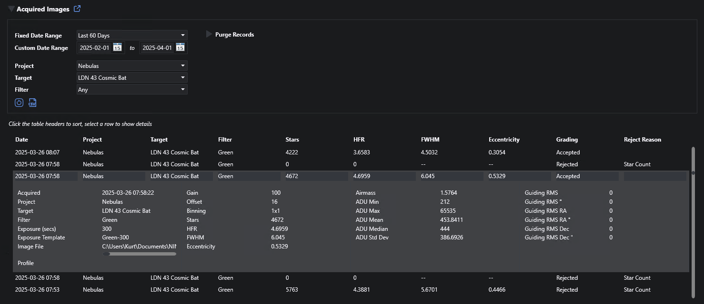

# Acquired Images

The plugin saves metadata to the database for each exposure taken when the plugin is running the acquisition session - essentially the same metadata that NINA gathers and calculates for the image.  This data can be viewed on the plugin home page (NINA Plugins > Target Scheduler) by expanding the Acquired Images section.

In addition to providing the means to review acquisition data, the records are also used to provide samples for the [Image Grader](image-grader.html).

## Filtering

Several options exist to restrict the records displayed.  To select by date:
* Select a preset date range from the Fixed Date Range dropdown.
* Or enter custom From and To dates.

So that the date range is inclusive, the From date will always have a time of midnight and the To date will use 23:59:59.

You can further restrict the records by Project, Target, and Filter used:
* Project: Select a project from the dropdown.  Note that projects across all NINA Profiles will be shown.
* Target: If you select a project, you can select one of the targets for that project.
* Filter: If you select a target, you can further select one of the filters used for that target.

## Viewing

* You can click a table header to sort the table, click the same header again to sort in the opposite direction.
* Select a row in the table to view details.

## CSV Output

Click the CSV icon to write the results of the current query to a CSV file.  The output file does not reflect any sorting changes you make to the table itself.

The column order was chosen to mimic the CSV output of the Session Metadata plugin.

## Purging Records

To remove acquired image records, expand the Purge Records header.  There are two ways to select the records:
* By date: set the Older Than date to the date desired (it defaults to nine months before present) and leave Target as 'All'.  All records - regardless of target - will be removed.
* By date and target: set the Older Than date to the date desired and then select your target from the dropdown.  Only those records for that target older than the date will be removed.

Click the delete (trashcan) icon to execute.  In both cases, you will be asked to confirm the deletion.

### Notes
* Keep in mind that these records are used for image grading so if you think you might want to continue imaging a relevant target in the future, you might not want to remove associated records.
* There is only a weak reference to the applicable project, target, and filter for each record.  You could delete or move projects, targets, or exposure plans which may impact what can be shown, selected, or deleted.
* You can however, choose to automatically delete the records associated with targets when deleting projects and targets.  See the _Delete Acquired Images_ [preference](../target-management/profiles.html#profile-preferences) (enabled by default).

## Data Saved

The following values are saved (although not all may be displayed).  The description is missing for items that are self-explanatory and/or come directly from underlying NINA data.  Note that some values may be empty if not applicable for your equipment.

| Property               | Description                                                 |
|:-----------------------|:------------------------------------------------------------|
| Acquired Date          | Date/time the exposure finished                             |
| Project                | The associated project                                      |
| Target                 | The associated target                                       |
| Filter                 | Filter used for the exposure                                |
| Exposure (secs)        | Exposure duration                                           |
| Exposure Template      | Name of the associated Exposure Template                    |
| Image File             | Full path to the image file on disk                         |
| Profile                | Name of the associated NINA profile                         |
| Gain                   |                                                             |
| Offset                 |                                                             |
| Binning                |                                                             |
| Stars                  |                                                             |
| HFR                    |                                                             |
| FWHM                   | Requires Hocus Focus                                        |
| Eccentricity           | Requires Hocus Focus                                        |
| Airmass                |                                                             |
| ADU Std Dev            |                                                             |
| ADU Mean               |                                                             |
| ADU Median             |                                                             |
| ADU Min                |                                                             |
| ADU Max                |                                                             |
| Guiding RMS            |                                                             |
| Guiding RMS ArcSec     |                                                             |
| Guiding RMS RA         |                                                             |
| Guiding RMS RA ArcSec  |                                                             |
| Guiding RMS Dec        |                                                             |
| Guiding RMS Dec ArcSec |                                                             |
| Focuser Position       |                                                             |
| Focuser Temp           |                                                             |
| Rotator Position       |                                                             |
| Pier Side              |                                                             |
| Camera Temp            |                                                             |
| Camera Target Temp     |                                                             |
| Airmass                |                                                             |
| Accepted               | Exposure grading status: Pending, Accepted, or Rejected.    |
| Rejected Reason        | Reason for rejection, if not accepted by the Image Grader.  |

