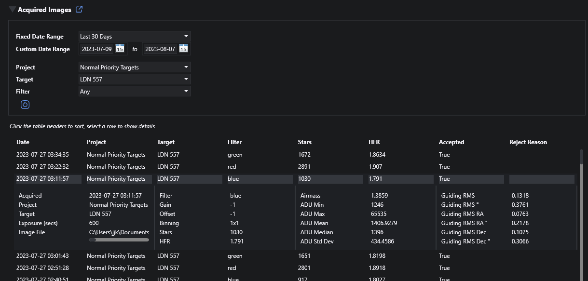

# Acquisition Data

The plugin saves metadata to the database for each exposure taken when the plugin is running the acquisition session - essentially the same metadata that NINA gathers and calculates for the image.  This data can be viewed on the plugin home page (NINA Plugins > Target Scheduler) by expanding the Acquired Images section.

In addition to providing the means to review acquisition data, the records are also used to provide samples for the [Image Grader](image-grader.html).

## Filtering

Several options exist to restrict the records displayed.  To select by date:
* Select a preset date range from the Fixed Date Range dropdown.
* Or enter custom From and To dates.

So that the date range is inclusive, the From date will always have a time of midnight and the To date will use 23:59:59.

You can further restrict the records by Project, Target, and Filter used:
* Project: Select a project from the dropdown.  Note that projects across all NINA Profiles will be shown.
* Target: If you select a project, you can select one of the targets for that project.
* Filter: If you select a target, you can further select one of the filters used for that target.

## Viewing

* You can click a table header to sort the table, click the same header again to sort in the opposite direction.
* Select a row in the table to view details.  

## Deleting Records

At present, there is no way to delete acquired image records.  Also, there is only a weak reference to the applicable project, target, and filter for each record.  You could delete or move projects, targets, or exposure plans which may impact what can be shown or selected.

A future release will support deleting old records.

## Data Saved

The following values are saved.  The description is missing for items that are self-explanatory and/or come directly from underlying NINA data.  Note that some values may be empty if not applicable for your equipment.

|Property|Description|
|:--|:--|
|Project|The associated project|
|Target|The associated target|
|Date|Date/time the exposure finished|
|Filter|Filter used for the exposure|
|Accepted|Whether the exposure was accepted by the Image Grader or not.  Will be false if grading is disabled.|
|Rejected Reason|Reason for rejection, if not accepted by the Image Grader.  Will be 'not graded' if grading is disabled.|
|File Name|Full path to the image file on disk|
|Duration|Exposure duration|
|Gain||
|Offset||
|Binning||
|Stars||
|HFR||
|HFR Std Dev||
|ADU Std Dev||
|ADU Mean||
|ADU Median||
|ADU Min||
|ADU Max||
|Guiding RMS||
|Guiding RMS ArcSec||
|Guiding RMS RA||
|Guiding RMS RA ArcSec||
|Guiding RMS Dec||
|Guiding RMS Dec ArcSec||
|Focuser Position||
|Focuser Temp||
|Rotator Position||
|Pier Side||
|Camera Temp||
|Camera Target Temp||
|Airmass||

