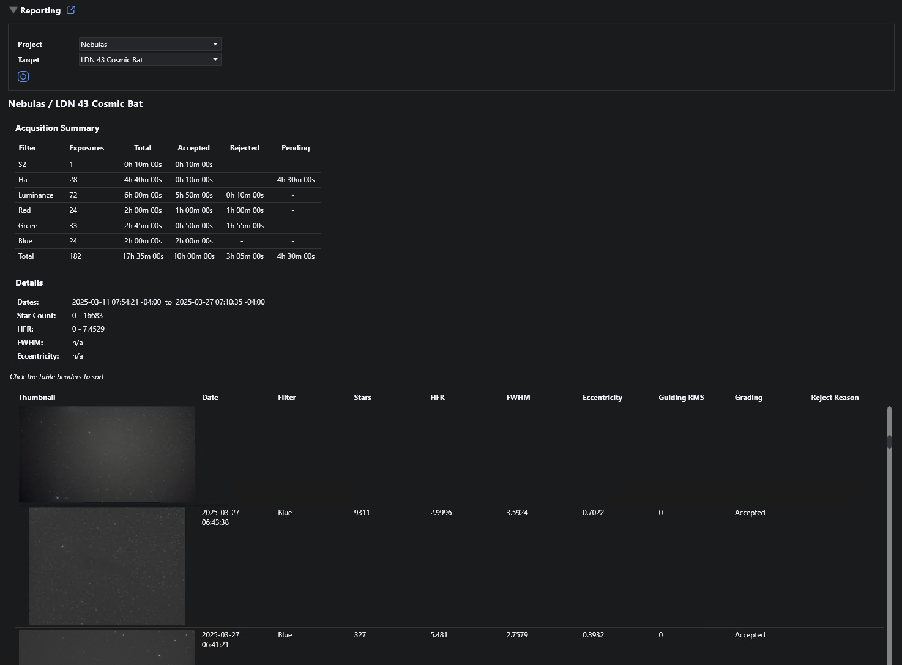

# Reporting

{: .note }
The reporting capability should be considered experimental at this point and is likely to evolve.  Comments and suggestions are welcome.

Target Acquisition reports can be generated from the persisted exposure metadata for [acquired images](acquisition-data.html).  Reports can be viewed on the plugin home page (NINA Plugins > Target Scheduler) by expanding the Reporting section.

Once you select a profile, project, and a target, the acquisition report will be displayed:

## Acquisition Summary

The summary displays a table showing total acquisition time broken down by filter.  For each filter, the number of exposures and the overall total time is shown, as well as the totals for Accepted, Rejected, and Pending exposures.  A final row totals across all filters.

## Details

The details section shows the date range for target's exposures as well as the minimum and maximum values for key image metrics.

## Exposures Table

The exposures table displays all exposures, a thumbnail image, and selected exposure details.
