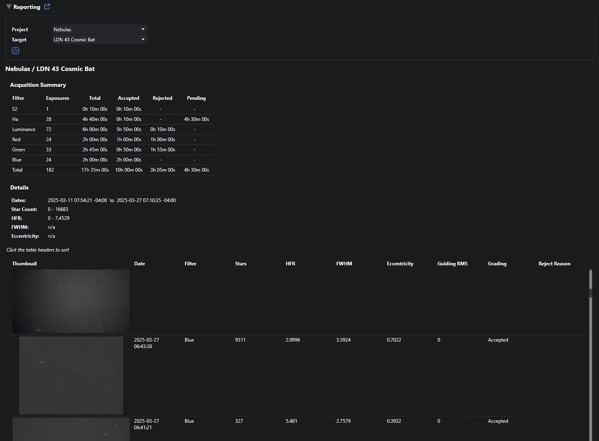

# Reporting

{: .note }
The reporting capability should be considered experimental at this point and is likely to evolve.  Comments and suggestions are welcome.

Reports can be generated from the persisted exposure metadata for [acquired images](acquisition-data.html) and can be viewed on the plugin home page (NINA Plugins > Target Scheduler) by expanding the Reporting section.

You can display two different types of reports in the Reporting section: a Profile Summary or an Acquisition Summary for a particular target.

## Profile Summary

If you select a profile in the dropdown and then click the report icon to the right, the Profile Summary report will be displayed. This will display an expandable list of all projects in the profile and all targets for those projects. At the target level, the percent complete for each exposure plan is displayed. The report can also be exported to HTML by clicking the HTML icon.

## Acquisition Summary

Once you select a profile, project, and a target, the acquisition report will be displayed:

The summary displays a table showing total acquisition time broken down by filter.  For each filter, the number of exposures and the overall total time is shown, as well as the totals for Accepted, Rejected, and Pending exposures.  A final row totals across all filters.

## Details

The details section shows the date range for target's exposures as well as the minimum and maximum values for key image metrics.

## Exposures Table

The exposures table displays all exposures, a thumbnail image, and selected exposure details.
