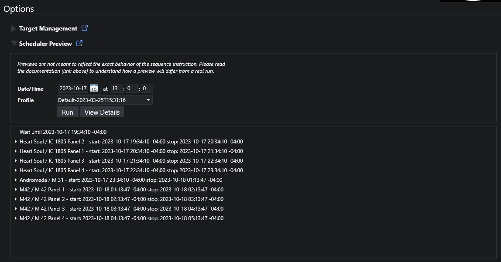
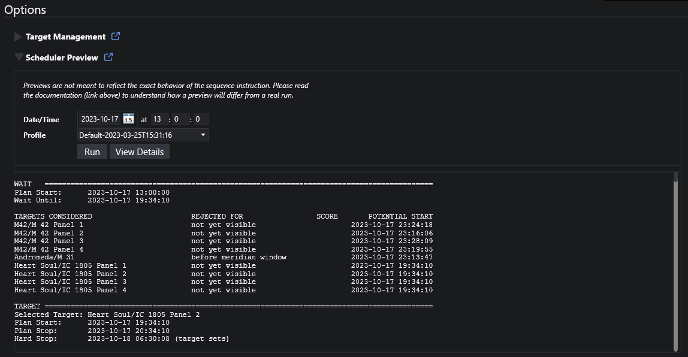

# Scheduler Preview

You can preview schedules on the plugin home page (NINA Plugins > Target Scheduler) by expanding the Scheduler Preview section.

Select a date/time and the desired profile to get started.  Click the clock icon to reset date/time to now.  When you click the Run button, the planner will find all active projects for that profile and then determine the targets to image for that date.  The panel below will display the series of plans returned by the planner, showing each project/target with the associated instructions underneath (assuming at least one target meets the criteria).  There may also be 'wait' operations if nothing is visible now but will be later.

{: .warning }
Previews are not meant to reflect the exact behavior of the sequence instruction.  Please read the following to understand how a preview differs from an actual run in the NINA Sequencer.

A preview works by first calling the [Planning Engine](concepts/planning-engine.html) with the date/time specified.  It than repeatedly calls the engine using the stop time of the previous target as the next start time, until no more targets are returned.  By doing this, it is assuming that the work for each target will run for exactly that time interval (which is often the project's minimum imaging time).  A preview also assumes that all images are acceptable.

However, the real Target Scheduler Container works quite differently:
* If it finishes executing all instructions for a target, it will stop and immediately call the engine again to get the next target.
* More likely, the container would continue running well past the stop time since the time required to execute those instructions _plus all applicable triggers_ will take significantly longer.
* In addition, acquired images are not assumed to be acceptable.  Instead, they will be graded by the [Image Grader](post-acquisition/image-grader.html) (if enabled) or left for the user to manually accept/reject.

Since nearly every sequence will have triggers to autofocus or handle meridian flips (both lengthy operations), target plans will rarely finish at the planned time.  This typically isn't an issue and if the target sets or loses visibility during that time, the plan will be aborted and the engine will be called again.

The following image shows the results of a preview run.  Each line in the output shows one run of the planning engine - either a 'wait' or a specific target.  For runs that return targets, you can expand the line to see the instructions that will be executed to image the target.

## View Details

If you need additional insight into what the planner is doing, click the View Details button.  This will display a detailed log of the candidate targets that were considered and why they were or weren't chosen.  For targets that were scored by the Scoring Engine, additional details are shown for all the scoring rules.

The following image shows the 'View Details' log from the same image as shown above.

The same information is also written to the [Target Scheduler log](technical-details.html#logging) for actual (non-preview) runs via the sequencer.
