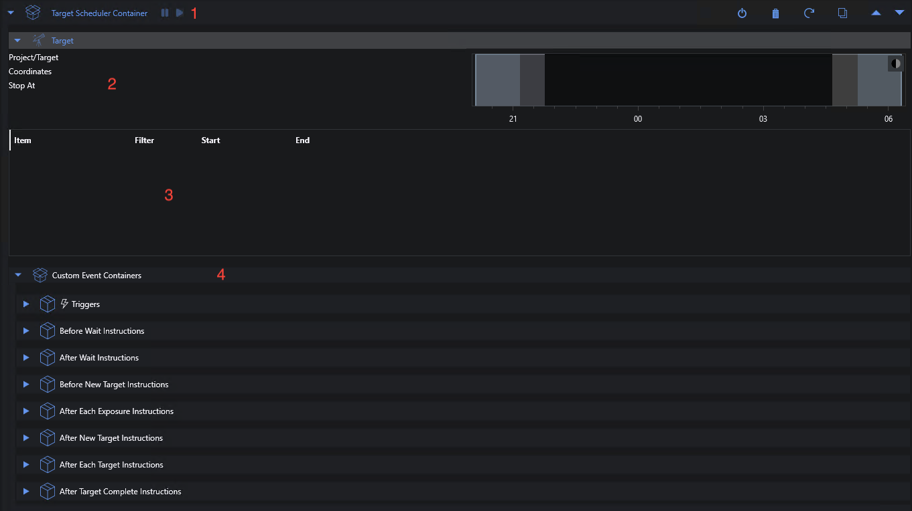

# Target Scheduler Container

The primary instruction associated with the plugin is _Target Scheduler Container_.  This instruction replaces the Deep Sky Object Instruction Set container that you would typically use as the parent for your imaging instructions and triggers.  Triggers can be added to it as needed and should interact with the plugin as expected - for example various autofocus triggers, meridian flip, center after drift, etc.  See below for more information on triggers.

You can have a parent container (e.g. Sequential Instruction Set container) and add Target Scheduler Container to it.  This parent container may have loop conditions and/or triggers to handle safety and other global concerns.  Containers above Target Scheduler Container in the sequence hierarchy may need to use the [Target Scheduler Condition](condition.html) loop condition to break out in certain scenarios.

See the [technical details](../technical-details.html#target-scheduler-container-operation) for more information.

## Interface

The following shows a Target Scheduler Container instruction after adding to a sequence but before the sequence is running.

It consists of four main areas:
1. **Pause/Resume**.  When the container is running, you can pause and resume - see below.
2. **Target Details**.  When the planner returns a target to image, the details - including the nighttime/altitude chart - will be displayed here.
3. **Plan Progress**.  Each plan returned by the planner will generate an expandable section here containing details on what is happening and what has been completed.
4. **Custom Triggers/Instructions**.  Expand _Custom Event Containers_ to get access to the Triggers and other event-based instruction containers. Drag/drop other NINA sequence items to those areas as needed.

## Pausing the Container

The pause/resume buttons on the instruction header can be used to stop the container for a period of time.  These buttons are only active when the container is actually imaging.

These controls are also available in the scheduler's [Imaging tab panel](imaging-panel.html).

### Pause
If the container is running, you can click the pause button.  This will trigger a _request to pause_ when the next planned exposure finishes (it will not be interrupted).  If a new target just started and it's still in the process of slewing/centering, it will still proceed to the first planned exposure before pausing.  Other triggers (e.g. autofocus) may also run before the container is actually paused.

The NINA sequence progress/status display (at the bottom of the screen) will show how long the pause has been active.

### Resume
When the container is paused, you can resume operation by clicking the resume button.  The container will call the planner immediately to get the next target/exposure appropriate to the current time.

## Triggers

{: .warning }
Note that adding triggers to this section is **_rarely_** needed.  In general, triggers to handle auto-focus, meridian flips, center after drift, etc should be added to the triggers section of a container above the Target Scheduler Container.

Sequence triggers are generally used to either invoke some operation or interrupt execution based on the state of the software and the attached equipment.  Unlike the DSO Instruction Set container which has a fixed target for the duration of an imaging session, the Target Scheduler Container may get a new target each time it calls the Planning Engine.  This poses challenges when using triggers that depend on knowing the coordinates of the current target:
* During a Wait period, the target has default coordinates of RA 0 and Dec 0.
* When the planner returns a new target the coordinates are updated to reflect that target.

Any triggers placed _under_ Target Scheduler Container should be thoroughly tested before unattended operation.  In general, it's not necessary (and perhaps incorrect) to put any of the core NINA triggers inside this triggers container.  Triggers added by other plugins may need to be placed here but you're on your own.

The NINA Center after Drift trigger requires special handling.  First, **_never_** put it in the Triggers section under Target Scheduler Container where it will be explicitly ignored.  Instead, place it in the triggers section of a container above Target Scheduler Container.  Second, the CaD trigger needs to know the current target coordinates to determine drift.  When the Target Scheduler Container gets a Target Plan, it locates the trigger in the sequence hierarchy and injects the target coordinates.  If it is working properly, the CaD instruction UI will correctly show drift and status.

## Custom Event Instructions

Five areas are provided to drag/drop sequence instructions for execution at specific times during planner operation:
* **Before Wait**: run before each wait operation.  For example, park the mount.
* **After Wait**: run after each wait operation.  For example, unpark the mount.
* **Before New Target**: run before each new or changed target begins imaging.  Instructions here will be run _after_ a slew/center so that items like autofocus can be performed pointing at the target.
* **After Each Exposure**: run after every exposure.
* **After New Target**: run after each new or changed target completes imaging or is interrupted.
* **After Each Target**: run after every target plan, regardless of whether it's new or not.  An important use case of this is with the [Target Scheduler Immediate Flats](../flats.html#target-scheduler-immediate-flats) instruction.
* **After Target Complete**: run when a target reaches 100% complete for all exposure plans.

Expand the individual containers to add items and then drag/drop instructions to the drop area as usual.  In general, any NINA instruction can be added but you should always test before unattended operation.

Note that the Before/After New Target instructions will _only_ be executed when the target is new or changed from the previous plan.  Returning to the same target is a common occurrence since the planner will often select the same target if nothing else is available.

If you're running [synchronized](../synchronization.html), the instructions in these containers will run only on the server, not clients.  However, you can also add custom event instructions to [Target Scheduler Sync Container](../synchronization.html#target-scheduler-sync-container).

See the [plan timeline diagrams](../concepts/planning-engine.html#plan-types-and-timelines) which show precisely when the event containers will be executed.

### Coordinates Injection

Some core NINA instructions assume that they can inherit target coordinates from the surrounding context - for example a parent DSO Container.  Since targets are dynamic with Target Scheduler, we have to take steps to inject the current target coordinates into those instructions if running as part of a custom event container.  For the _Before New Target_, _After New Target_, and _After Each Target_ containers, the following instructions (if found) will have this behavior:
* Slew To Ra/Dec
* Slew and center
* Slew, center and rotate

In general, you shouldn't have to add these instructions to an event container since Target Scheduler usually handles all target slewing for you.  However, when using [Target Scheduler Immediate Flats](../flats.html#target-scheduler-immediate-flats) with a wall panel flat device, you probably need Slew To Ra/Dec to return to the current target when the flats are complete.

### Custom Instruction Dos and Don'ts
* You can elect to use Park Scope in Begin Wait and Unpark Scope in After Wait.  If you do so, you should set the [Park on Wait](../target-management/profiles.html#profile-preferences) preference to false.  However, the benefit of using the preference is that it will skip the park/unpark if the wait period is less than a minute.  In contrast, doing this in Before/After Wait would park/unpark even for a five second wait.
* There is no need to add instructions to stop tracking or guiding at the start of a wait - that will be done automatically and will also restart when the next target begins.
* You should not add any instructions to take exposures.  Doing so would confuse the scheduler mechanism used to watch images as they progress through the regular NINA image pipeline.
* You should not add instructions in response to safety interrupts (park/unpark, close/open RoR, etc).  Instead, you should handle that logic in the regular safety portions of your sequence.
* You can conceivably add other containers (e.g. Sequential or Parallel Instruction Set) but this has not been extensively tested.
* If you use instructions added by other plugins, you should test extensively.

## Validation

Target Scheduler Container will perform the usual sequence validation checks on any triggers and instructions added to the custom event containers.  If validation fails, the standard validation error marker will be displayed and the reason is available by mousing over the offending instruction.  Be aware that Target Scheduler Container will be _skipped entirely_ if validation errors remain when the sequence reaches that point.

## Instruction User Interface

The Target Scheduler Container interface in the advanced sequencer is similar to the core Deep Sky Object Instruction Set container - the main difference being that the target coordinates and altitude chart will update dynamically as the [Planning Engine](../concepts/planning-engine.html) returns new targets.

Before imaging begins, these elements will be empty.  When the instruction starts, the Planning Engine will be called and (if a target was selected), the elements will update to reflect that target.

In addition, the area below the chart will have a panel detailing the individual NINA instructions executed to implement the plan.  Each time the Planning Engine returns a new target to image, a new expandable line will be added.  This history will be retained for viewing until the sequence is reset.  It is not saved when you save a sequence file.
