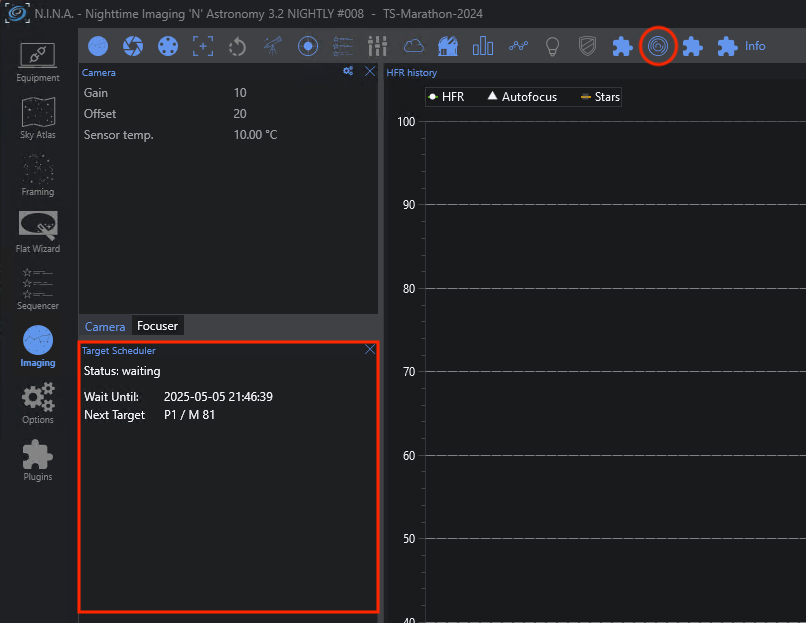
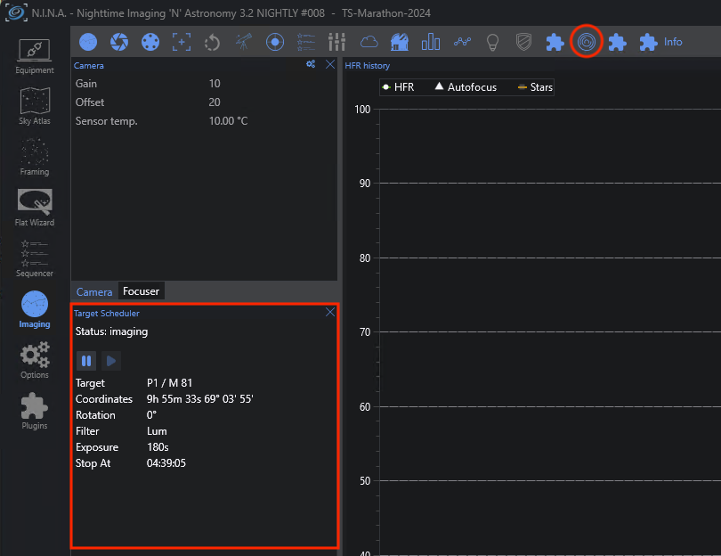

# Imaging Tab Panel

Like many plugins, Target Scheduler adds a custom dockable panel to the NINA Imaging tab.  You can enable/disable the panel by clicking the TS plugin logo in the header bar.  The panel should behave like any other and can be dragged/dropped to customize your display.

The panel has three states, depending on the status of the TS Container instruction.

## Inactive
The panel is 'inactive' if the container instruction either hasn't run yet or has run and the sequence finished or was stopped.

## Waiting
The panel is 'waiting' if the scheduler planner returned a wait period to wait for the next available target.

## Imaging

The panel is 'imaging' if a target is actively imaging and taking exposures.  You can pause/resume the container during imaging.  The buttons behave the same as they do on the container instruction itself.  See [pausing the container](container.html#pausing-the-container) for details.

