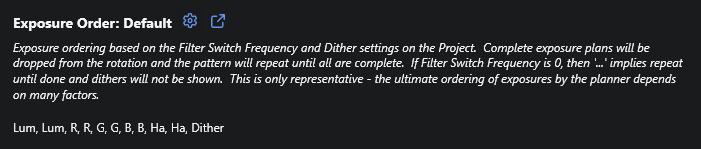
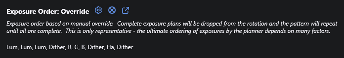
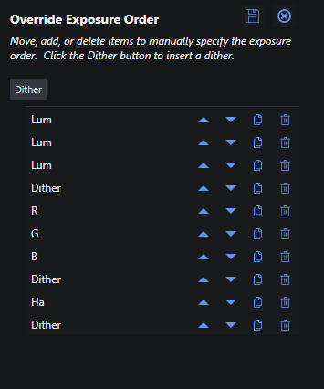

# Exposure Plans

Each target has one or more associated _Exposure Plans_ that describe the actual exposures to be taken.  An Exposure Plan only has a few properties - but it references an [Exposure Template](exposure-templates.html) that provides many more.

## Basic Operations

### Exposure Plan Creation

New Exposure Plans are added by navigating to the desired target, entering Edit mode, and clicking the Add exposure plan icon.  A new exposure plan is initialized with default values and always references the first Exposure Template for the applicable profile.

{: .note}
If you have not yet created any Exposure Templates for this profile, you will be warned and will have to create at least one before proceeding.

### Copy/Paste

When the target is _not_ in Edit mode, you can copy all Exposure Plans for a target and then paste them to the same or different target.  This is especially useful when you have imported the targets for a mosaic: create the Exposure Plans for one target then copy and paste to all of the others.

If you copy Exposure Plans from a target under one profile and then paste to a target under a different one, you will be notified that the referenced Exposure Templates have been reset to the default for the profile and you will have to edit them.

If the copied Exposure Plans had an [override exposure ordering](#override-ordering), that order will also be copied - but only if the destination target is in the same NINA Profile as the source target and has no Exposure Plans of its own when the paste is started.

### Delete All Exposure Plans

When the target is _not_ in Edit mode, and you have at least one Exposure Plan, you can delete all exposure plans with a single click.

### Exposure Plan Editing

Exposure plan fields are edited in line in the same table used for viewing them.  Simply double-click a field and make your change.  You will have to tab-out of the field to enable the Save icon.

When done, click the Save icon for the Target to save your changes or the Cancel icon to cancel.

### Exposure Plan Deletion
When the target is _not_ in Edit mode, you can delete exposure plans by clicking the Delete icon.

### Exposure Plan Properties

|Property|Type|Description|
|:--|:--|:--|
|Template|dropdown|[Exposure Template](exposure-templates.html) to use for this plan.|
|Exposure|double|Exposure time in seconds.  Leave blank to use the default defined for the template.|
|Desired|integer|Number of desired images for this plan - see below.|
|Accepted|integer|Number of accepted images for this plan - see below.|
|Acquired|integer|Total number of images acquired for this plan.  Read only.|
 
### Number of Images

As part of an exposure plan, you set the total number of images you **_Desire_** for the plan.  The plugin will continue to schedule exposures for this plan as long as the number desired is greater than the number **_Accepted_**.

The number of Accepted images can either be automatically set by action of the [Image Grader](../post-acquisition/image-grader.html) (incremented for each image that passes) or the value can be managed manually if you prefer.  If you manage it manually however, you are responsible for adjusting the value after you have reviewed the latest images - otherwise the plugin will continue to schedule exposures even if the number Desired is surpassed.  The [Exposure Throttle](profiles.html#general-preferences) preference can be used to manage this behavior.

The number **_Acquired_** is incremented for each exposure and is read-only.

## Exposure Order

The Exposure Order display shows the ordering of exposures and dither operations by the planner.  The ordering can be the default (automatic) or manually overridden.  Click the gear icon to create an override.  Once you have an override, you can remove it by clicking the cancel icon when it is shown.

### Default Ordering

By default, exposure order is automatically determined based on the set of exposure plans plus the [Filter Switch Frequency](projects.html#filter-switch-frequency) and [Dither After Every](projects.html#dithering) settings on the associated Project.  The displayed order shown is merely representative and has some limitations:
* If Filter Switch Frequency is zero (repeat each plan until complete), it just shows '...' after each and dithers will not be shown.
* Each plan will be shown regardless of whether it is complete or not.
* Other factors could impact how exposures are planned - for example the twilight level of the associated Exposure Templates.

None of these limitations impacts how the actual exposure planner works.

### Override Ordering

If the automatic exposure ordering doesn't meet your needs, you can override it and specify your own.  When you click the gear icon it will open a popup where you can create or edit an override exposure order.  It starts with a simple list of the current Exposure Plans for the target.  You can then duplicate them, move them up/down, or delete them.  You can also insert a Dither by clicking the Dither button.  This will add the Dither either after the selected row or at the end if none is selected.

When done, click Save to save or cancel to cancel.

It's important to understand the following when overriding Exposure Order:
* You are responsible for ensuring that the ordering makes sense.  In particular, if you delete the last instance of an Exposure Plan in the override list, then that plan would never get scheduled.  You would have to cancel the override and then recreate it.
* If you add or delete Exposure plans, then the override list is reset back to the default order.  **_There is no warning before this takes place._**
* If you change the Exposure Template for a plan, that plan will be updated to the new template name in the override list.
* Be aware that you're likely to over-dither as exposure plans reach completion or are rejected for moon avoidance.  The dithers are fixed in the order and the fact that exposures prior to that are dropped doesn't stop inclusion of the dither.
