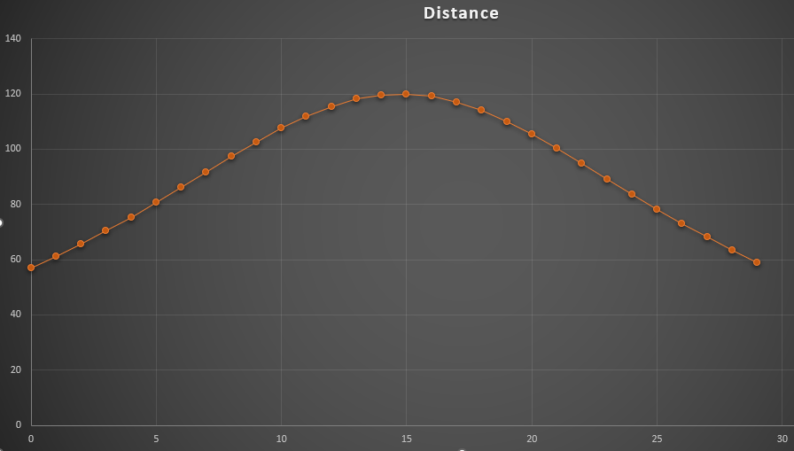

# Exposure Templates

_Exposure Templates_ provide the ability to set several exposure-related properties that are commonly used for the associated filter and the rig described by the applicable profile.  Configurable properties include gain, offset, binning, and camera readout mode.  You can also set the level of twilight and the moon avoidance parameters appropriate for the filter.

Each [Exposure Plan](exposure-plans.html) references a single Exposure Template.  With this approach, most of the reusable exposure properties are decoupled from Exposure Plans and easily reused.

{: .note}
Each Exposure Template explicitly references a single filter configured on your filter wheel _by name_.  If you later change the filter name in the filter wheel configuration, you will need to update any Exposure Templates that reference that filter.

## Basic Operations

### Exposure Template Creation

New templates are added by selecting the applicable profile in the Exposure Templates navigation tree and then clicking the Add icon.  The new template is saved, added to the navigation tree, and selected.  Click the Edit icon to make changes.  Note that you will have to set the filter to one of the filters defined in the filter wheel for this profile.

When you select a profile in the Exposure Templates navigation tree, the right panel shows a table of all templates for that profile.  From there, you can jump to the view/edit panel for the template or copy it to the clipboard.  After copying a template, you can paste it under this profile or select a different profile in the tree and paste it there.

### Exposure Template Editing

Click the Edit icon to begin editing the template.  The property value fields become active and you can make changes.  Note that you typically have to tab out after editing to enable the Save icon.

When done, click the Save icon to save your changes or the Cancel icon to cancel.

### Exposure Template Properties

| Property                 | Type         | Description                                                                                                                                                          |
|:-------------------------|:-------------|:---------------------------------------------------------------------------------------------------------------------------------------------------------------------|
| Name                     | string       | The name of the template                                                                                                                                             |
| Filter                   | dropdown     | The name of the associated filter on the filter wheel for the profile.                                                                                               |
| Default Exposure         | double       | The default exposure duration to use unless overridden in Exposure Plans.  Exposure plans using the template default will pick up a change on the next planning run. |
| Gain                     | integer      | The desired gain setting for the exposure.  Leave blank to use the default defined for the camera.                                                                   |
| Offset                   | integer      | The desired offset setting for the exposure.  Leave blank to use the default defined for the camera.                                                                 |
| Binning                  | dropdown     | The binning mode for the exposure.                                                                                                                                   |
| Readout Mode             | integer      | The desired readout mode setting for the exposure.  Leave blank to use the default defined for the camera.                                                           |
| Acceptable Twilight      | dropdown     | The brightest level of twilight that is suitable for using this filter - see below for details.                                                                      |
| Twilight Offset          | integer      | An offset in minutes (plus or minus) from the acceptable twilight time - see below for details.                                                                      |
| Dither After Every       | integer      | Value to determine how dithering is handled - see below for details.  Leave blank to use the default defined for the applicable project.                             |
| Maximum Humidity         | double       | The maximum acceptable value of humidity for exposures using this template - see below.                                                                              |
| Enable Classic Avoidance | boolean      | Enable/disable the classic moon avoidance calculation - see below.                                                                                                   |
| Classic Separation       | 0 to 180°    | The separation angle for the moon avoidance calculation - see below.                                                                                                 |
| Classic Width            | integer 1-14 | The width in days for the moon avoidance calculation - see below.                                                                                                    |
| Relaxation / Scale       | dropdown     | The scaling factor (or off) for avoidance relaxation - see below.                                                                                                    |
| Minimum Altitude         | -90° to -1°  | The lower moon altitude limit of the relaxation range for avoidance relaxation - see below.                                                                          |
| Maximum Altitude         | 0° to 30°    | The upper moon altitude limit of the relaxation range for avoidance relaxation - see below.                                                                          |
| Moon Must Be Down        | boolean      | Reject exposure if the moon altitude is above the relax maximum altitude, regardless of phase or separation - see below.                                             |

## Acceptable Twilight and Offsets
Without an offset the acceptable twilight time limits exposures using this template to the time extending from the start of this twilight level at dusk to the end of the level at dawn.

You can add an offset that shifts the acceptable time.  The value is positive or negative minutes and is used as follows:
* At dusk, the value is _added_ to the _start_ of the twilight level.  For example, if astronomical twilight starts at 8:00pm, then an offset of -10 shifts the acceptable period earlier by 10 minutes to 7:50pm.
* At dawn, the value is _subtracted_ from the _end_ of the twilight level.  For example, if astronomical twilight ends at 5:00am, then an offset of -10 shifts the acceptable period later by 10 minutes to 5:10am.

Note that there is no check for offset values that don't make sense.  For example a value of -5000 is likely before local sunset.

## Dithering
You can enable a dither frequency at the exposure level, overriding the value set on projects.  For exposure plans using this exposure template:
* Leave blank to use the project value
* Set to zero to completely disable dithering
* Otherwise, if the dither setting is _N_, a dither will be added before the _N+1th_ occurrence of this filter.

Notes:
* Dithering is determined based on the _filter name_ - not the exposure template name.  Since you could have different exposure plans using the same filter, we want to ensure that when that filter is selected again, we dither appropriately.
* Any dither operation resets the count for all filters.
* The Dither setting is ignored if you're using an [override exposure order](exposure-plans.html#override-ordering) for any Target using this template.

See [Dithering](projects.html#dithering) for more information.

## Humidity
You can reject exposures using this template based on a maximum humidity value.  The value entered is the maximum acceptable relative humidity as reported by a connected weather device.  If no weather device is connected, this value is ignored.  A value of zero (the default) disables this behavior altogether.

On most typical nights, the temperature is dropping and the absolute humidity is approximately constant.  Once all remaining targets are rejected for humidity, the relative humidity isn't likely to decrease so by default, Target Scheduler will end for the night.  You can change this behavior by setting the Enable stop on humidity property to false in the applicable TS profile preferences.  In this case, TS will wait 15 minutes and then try again.

Note that humidity is ignored during [Scheduler Previews](../scheduler-preview.html).

## Moon Avoidance

Exposure Templates provide multiple options for controlling when exposures are permitted given the moon age (phase), separation from the target, and altitude.

### Classic Moon Avoidance

The Classic Moon Avoidance formula ("_Moon-Avoidance Lorentzian_") was formulated by the [Berkeley Automated Imaging Telescope](https://w.astro.berkeley.edu/bait/) (BAIT) team.  The formulation used here is from [ACP](http://bobdenny.com/ar/RefDocs/HelpFiles/ACPScheduler81Help/Constraints.htm).

The formula takes two fixed parameters: _separation_ (aka distance, in degrees) and _width_ (days).  From ACP:
*At full Moon the avoidance will be distance, and width days before (or after) the avoidance will be one half distance.*

If the angular distance from your target to the moon is less than the calculated avoidance separation, the exposure plan will be rejected.  As the separation increases or decreases throughout a night, the avoidance determination may change as the planner is called again.

### Relaxing Classic Moon Avoidance

Since the impact of the moon on sky quality diminishes as the moon gets near or below the horizon, it may be desirable to relax the impact of classic avoidance when this occurs.  If the Relaxation / Scale property is not 'Off', then relaxation applies:
* The scale value adjusts the impact by reducing the separation parameter, in effect shifting the entire avoidance curve down and permitting closer separations independent of moon age.
* The Minimum and Maximum Altitude values define the range over which relaxation occurs:
  * If the moon altitude is below the minimum, then avoidance is off altogether and the exposure will not be rejected (at least not for moon avoidance).
  * If the altitude is above the maximum, then classic, unrelaxed avoidance applies.

Otherwise, both the separation and width properties are scaled by the altitude to reduce the impact of avoidance:
* Separation = Separation + RelaxScale * (_altitude_ - MaxAltitude)
* Width = Width * ((_altitude_ - MinimumAltitude) / (MaximumAltitude - MinimumAltitude))

### Strict Avoidance for Moon Altitude
If relaxation is enabled and Moon Must Be Down is on, then exposures will be rejected if the moon is above the relax Maximum Altitude.  This occurs regardless of the phase (brightness) of the moon or the separation to the target.

#### Setting Classic Parameters
When enabled, set Separation to the minimum acceptable separation at full moon.  Then use Width to control how quickly the curve drops from the distance value.  Some charts make this clear: X = moon age in days, Y = calculated distance.

*Distance=120 and width=14*

*Distance=120 and width=4, showing much faster falloff from the peak distance value*

The values used on the ACP site are very conservative.  For narrowband imaging you could get away with distance=60 and width=7 which would need 60° separation at full moon but only 30° at first or last quarter.

#### Setting Relaxation Parameters

By default, relaxation will be off.  If avoidance is enabled, you can enable relaxation by setting a scale factor of 1-8.  The range defaults to -15° - 5°.  To adjust:
* More conservative (closer to classic): decrease the scale, increase the min-max range, and/or shift the range to lower altitudes.
* More aggressive: increase the scale, decrease the min-max range, and/or shift the range to higher altitudes.

The [attached Excel spreadsheet](Relaxed-Moon-Avoidance.xlsx) lets you experiment with different avoidance and relaxation settings and see the impact.  It can be used for both classic and relaxed avoidance.

## Color Cameras

If you're using Target Scheduler with a color camera and either don't use a filter wheel or use a single filter (e.g. for light pollution) in a filter tray for long periods of time, you can still configure Exposure Templates to work for your setup:
* Set up a dummy filter for your Filter Wheel.  Go to NINA Options > Equipment > Filter Wheel and add a new filter.  You need to provide a name, for example 'LP' or 'dummy'.
* In Target Scheduler plugin > Target Management, add a new Exposure Template as described above.  Set the Filter dropdown value to the filter you just created and name the Exposure Template appropriately (e.g. 'LP' or 'dummy').
* Set the other properties (exposure time, gain, offset, etc) as needed for your camera.

You can now reference this Exposure Template from your [Exposure Plans](exposure-plans.html) as usual.  In your NINA sequence, don't connect a filter wheel and any instruction to switch filters will simply be ignored.

You can implement a similar setup if using Target Scheduler with [synchronization](../synchronization.html#usage-without-a-filter-wheel).
