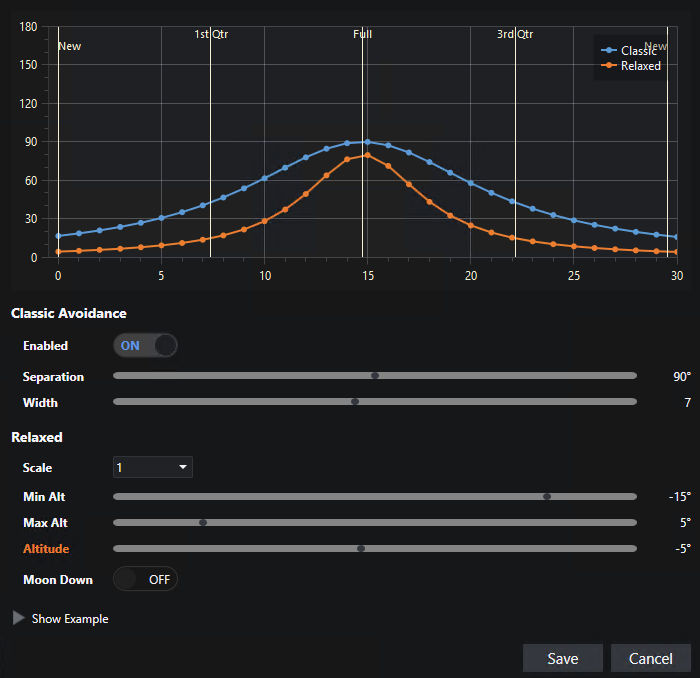
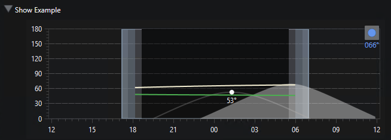
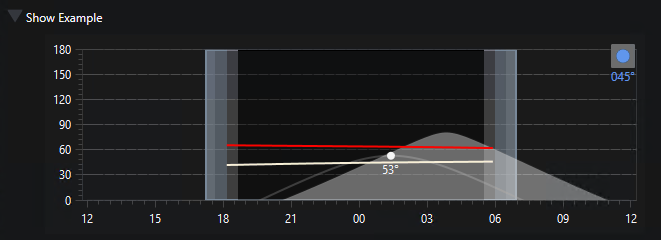
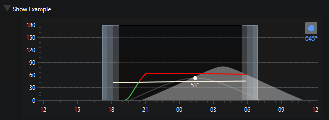

# Moon Avoidance Helper

The _Moon Avoidance Helper_ is an interactive tool that helps you understand and tune the moon avoidance settings on an [Exposure Template](exposure-templates.html).  Because the [classic](exposure-templates.html#classic-moon-avoidance) and [relaxed](exposure-templates.html#relaxing-classic-moon-avoidance) avoidance parameters interact in ways that can be hard to visualize, the helper lets you experiment with values and immediately see the resulting behavior - without having to save the template or run the planner.

{: .note}
The Moon Avoidance Helper is a visualization and tuning aid only.  It does not change how the planner evaluates avoidance at runtime - it simply shows you what the current parameters would do.

## Opening the Helper

The helper is available while editing an Exposure Template:

1. Select an Exposure Template in the navigation tree and click the Edit icon.
2. Click the **Moon Avoidance Helper** button (the moon icon).
3. The helper opens with the template's current avoidance parameters pre-populated.

## Using the Helper

The helper presents the moon avoidance parameters alongside a chart that updates as you change values:

| Control | Description |
|:--------|:------------|
| Separation | The avoidance separation (in degrees) at full moon. |
| Width | The width (in days) controlling how quickly the avoidance curve falls off from the peak separation. |
| Relaxation / Scale | The scale factor (or 'Off') applied as the moon approaches the horizon. |
| Minimum Altitude | The lower moon altitude limit of the relaxation range. |
| Maximum Altitude | The upper moon altitude limit of the relaxation range. |
| Moon Must Be Down | When enabled, exposures are rejected whenever the moon is above the relax maximum altitude. |

As you adjust these controls, the chart redraws to show the calculated avoidance separation across the lunar cycle.

When relaxation is enabled, you can adjust the Altitude slider to show the Relaxed curve for various moon altitudes. This is only for visualization - it has no impact on any avoidance calculation.  The following shows a typical example:

## Show Example

Of course the separation curves are only part of the story. If you click the **Show Example** button you'll open a new section where you can pick a sample target and a date and show the actual calculated avoidance curves throughout the night. Green is acceptable and red is rejected. Clicking the date forward or backward quickly shows you how the parameters will be applied as both the target and the moon shift across the nighttime sky.

{: .note}
The example _only_ takes into account moon avoidance. None of your other project/target visibility settings are applied here.

The following shows a target on a date where the actual target separation is around 66° and the acceptable separation is around 47° - so acceptable. (Note that the 53° on these charts indicates the target's altitude at time of transit - not related to the avoidance calculations. But you can mouse over the two separation curves to see the altitude.)

But just two days earlier the moon was positioned so that actual separation was 45° and acceptable was 64° - so rejected for avoidance:

But if relaxation is enabled, there is a short acceptable period as the moon is rising:

## Applying Your Changes

When you are satisfied with the values:

* Click **Save** to copy the parameters back into the Exposure Template being edited.  You still need to **Save** the template to persist the changes.
* Click **Cancel** to close the helper without changing the template.

## See Also

* [Moon Avoidance](exposure-templates.html#moon-avoidance) - full description of the avoidance parameters.
* [Classic Moon Avoidance](exposure-templates.html#classic-moon-avoidance)
* [Relaxing Classic Moon Avoidance](exposure-templates.html#relaxing-classic-moon-avoidance)