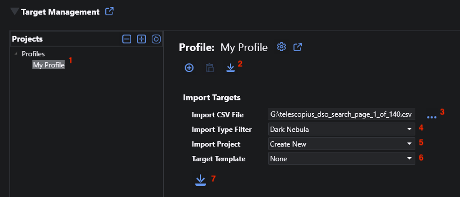

# Targets

A _Target_ represents a single DSO object with RA/Dec coordinates, frame rotation, and ROI.  A target always has a parent project and inherits those project properties.

Target coordinates can be manually entered or imported from the NINA catalog, the NINA Framing Assistant, targets saved for the advanced sequencer, or an attached planetarium program (e.g. Stellarium).

[Exposure Plans](exposure-plans.html) are also managed from the Target view/edit panel - see that page for details.

## Basic Operations

### Target Creation

New targets are added by navigating to the desired project and then clicking the Add icon.  The new target is saved, added to the navigation tree, and selected.  Click the Edit icon to make changes.

### Target Editing

Click the Edit icon to begin editing the target.  The property value fields become active and you can make changes.  Note that you typically have to tab out after editing to enable the Save icon.

### Target Import

To import a target, click the Edit icon to begin editing.  Then click the Import icon on the far right.  This will open a section with four import options:
* **NINA Catalog**. Enter the name of your DSO in the field - incremental search is supported.  Be sure to click on your selection to set the coordinates.
* **Framing Assistant**. If you have previously framed a target using the NINA Framing Assistant, click the icon to import those coordinates.
* **Sequence Target**.  In the Advanced Sequencer, you can save DSO Sequence containers to be reused (they appear under the Targets tab in the Advanced Sequencer upper right).  You can import those targets by clicking the icon.
* **Planetarium**. If you have configured the NINA connection to your planetarium software (Options > Equipment > Planetarium), click the icon to import coordinates from that source.

When done, click the Save icon to save your changes or the Cancel icon to cancel.

For importing targets in bulk, see [below](#bulk-target-import).

### Target Delete

To delete a target, click the Delete icon.  If the _Delete Acquired Images_ [preference](profiles.html#profile-preferences) (enabled by default) is on, then any [acquired image](../post-acquisition/acquisition-data.html) records (not image files) associated with that target will also be deleted.

### Target Properties

|Property|Type|Description|
|:--|:--|:--|
|Name|string|The name of the target.  This value will populate the \$\$TARGETNAME\$\$ pattern if used for image file naming (NINA Options > Imaging).  If you import a target, it will get the name from the import source.|
|Enabled|boolean|Enable/disable the target.  Disabled targets are not considered for scheduling.|
|Coordinates|HMS, DMS|The RA and Dec coordinates of the target.|
|Rotation|degrees 0-360|Frame rotation for the target.  If a rotator is attached, it will be set to this angle.  If a target is imported and the source supports rotation, it will be set on import.|
|ROI|integer 1-100|Region of Interest, will operate the same as the existing Take Subframe Exposure instruction.|

## Bulk Target Import

You can import multiple targets at once using the bulk import feature.  The importer supports two CSV formats (described below).

The procedure to perform a bulk import is the same regardless of CSV format.

1. Navigate to the applicable Profile in the navigation tree.  Bulk imports are always done at the profile level.
2. Click the import icon to expand the Import Targets section.
3. Click the '...' to select your CSV file.
4. You may optionally filter the targets to a single type by selecting the desired type in the Import Type Filter dropdown.  This dropdown will populate with the unique set of types after your CSV file has been selected.
5. Select the project to import the targets into.  This can be a new project or any other project currently defined for the profile.
6. By default, imported targets will have no Exposure Plans added.  However, you can select an existing target to use as a 'template': all exposure plans from the template target are copied to each new target (accepted and acquired counts are cleared).
7. When ready, click the import icon to execute.

You will be asked to confirm before the imported targets are saved.

By using the Import Type Filter and Target Templates, you can segregate imported targets by type while applying exposure plans appropriate to each type.  For example L/R/G/B for galaxies, Ha/OIII/SII for emission nebulae, etc. 

### Target Scheduler CSV

Target Scheduler uses a simple CSV file for some operations.  If you have an existing list of targets, it's usually straightforward to convert it into this format.  The file should include the header row and adhere to general CSV formatting conventions.

Columns:
* Type: target type or category, e.g. 'Galaxy' or 'Dark Nebula'
* Name: name, e.g. 'M 42'
* Ra: right ascension, e.g. 03h 47m 01s
* Dec: declination, e.g. 24º 07' 02"
* Rotation: frame rotation, e.g. 90
* ROI: region of interest (1-100), e.g. 80

### Telescopius CSV

You can also import targets that were exported in CSV format from [Telescopius](https://telescopius.com/).
